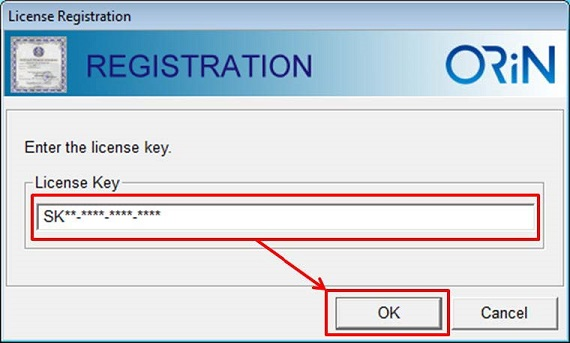
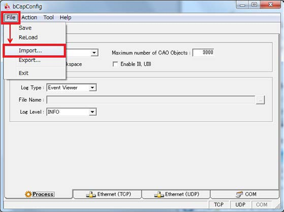
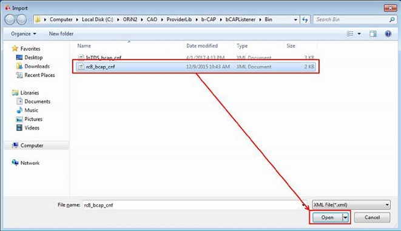
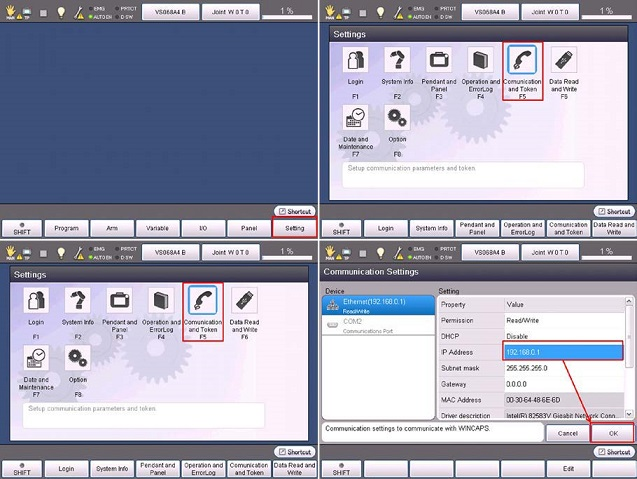

# ROS2 Driver Packages for DENSO Robots

The DENSO robot ROS2 stack contains libraries, configuration files, and ROS2 nodes for controlling a DENSO robot from ROS2 ([MoveIt2](https://moveit.ros.org/) and [Gazebo simulator](http://gazebosim.org/)).

|  |  | 
| :--: | :--: | 
| | | 


## 1. Overview

The DENSO robot ROS2 stack contains packages that provide nodes for communication with DENSO industrial robot controllers (RC8/RC8A and RC9).
The robot controller models that are currently supported are the following:

  - RC8 controller
  - RC8 controller (COBOTTA - not OSS)
  - RC8A controller
  - RC9 controller (**under construction**)

The supported robot models are the following:

  - 4-Axis (SCARA) robots
  - 5-and 6-Axis robots
  - Collaborative robots (not OSS type)


Moreover, the DENSO robot ROS2 stack provides URDF models for COBOTTA and VS-060 robotic arms and associated [MoveIt2](https://moveit.ros.org/) configuration packages (as standard components).
To control other robot types, see the _ROS2Converter_ page (**under construction**) for creating the URDF model and the associated [MoveIt2](https://moveit.ros.org/) configuration package.


## 2. Packages in the Repository

**Robot control packages:**

  - `bcap_core` - core libraries for [b-CAP communication protocol](https://www.denso-wave.com/en/robot/product/function/b-CAP.html)
  - `bcap_service_interfaces` - messages and services used by the `bcap_core` node
  - `bcap_service` - ROS2 node for low-level communication with robot controller through b-CAP protocol
  - `denso_robot_core_interfaces` - actions and messages used by the `denso_robot_core` node
  - `denso_robot_core` - ROS2 node that exposes Controller, Robot, Variables, Task classes
  - `denso_robot_control` - hardware interface that exposes planning and control functions for a real DENSO robot

**Robot descriptions package:**

  - `denso_robot_desciptions` - description files for specific DENSO robot models (meshes, URDF, etc.)

**Motion planning packages:**

  - `denso_robot_moveit_config` - [MoveIt2](https://moveit.ros.org/) configuration files for specific DENSO robot models (SRDF, controller types, etc.)
  - `denso_robot_moveit_demo` - ROS2 node for moving a robot (both simulated and real) using the [MoveIt2](https://moveit.ros.org/) motion planner (8 fixed positions, according to the robot model)

**Startup package:**

  - `denso_robot_bringup` - main launch files and configuration settings


## 3. Installation

1. Install [ROS2 Humble](https://docs.ros.org/en/humble/Installation/Ubuntu-Install-Debians.html)

2. Make sure that `colcon`, its extensions and `vcs` are installed:

   ```bash
   sudo apt install python3-colcon-common-extensions python3-vcstool
   ```

3. Create a new ROS2 workspace:

   ```bash
   export COLCON_WS=~/workspace/denso_ros2_ws
   mkdir -p $COLCON_WS/src
   ```

4. Pull `denso_robot_ros2` packages:

   ```bash
   cd $COLCON_WS
   git clone -b humble https://github.com/DENSORobot/denso_robot_ros2.git src/denso_robot_drivers_ros2
   vcs import src --skip-existing --input src/denso_robot_drivers_ros2/denso_robot_drivers_ros2.repos
   ```

5. To use [MoveIt2](https://moveit.ros.org/), install the [required packages (binary installation, Humble version)](https://moveit.ros.org/install-moveit2/binary/).

6. Install dependencies (if not already installed):

   ```bash
   sudo apt install ros-humble-ros2-control
   sudo apt install ros-humble-ros2-controllers
   ```

7. Compile and source the workspace:

   ```bash
   rosdep install --ignore-src --from-paths src -y -r
   colcon build --cmake-args -DCMAKE_BUILD_TYPE=Release
   source install/setup.bash
   ```


## 4. Controller Preparation

`denso_robot_ros2` packages use [b-CAP communication](https://www.denso-wave.com/en/robot/product/function/b-CAP.html), which is ORiN2 communication standard, to control DENSO robots.
Following are the instructions to setup DENSO hardware in order to interface DENSO ROS2 nodes with simulated or real robot.

### Simulated Environment with WINCAPS III
For controlling a WINCAPS III-simulated robot, a Windows computer is needed.
Windows computer where WINCAPS III runs.
The following steps show how to install and start a [b-CAP](https://www.denso-wave.com/en/robot/product/function/b-CAP.html) server on the Windows machine.

1. Install WINCAPS III in Windows computer. ORiN2 SDK, VRC, and DENSO ROBOTICS License Manager are installed with WINCAPS III simultaneously.

2. License registration: to control a WINCAPS III-simulated robot, the licenses of ORiN2 SDK, VRC, and WINCAPS III are required.
    Please inquire the following licenses of our sales staff.

| Application | License Type |
| :-------------: | :-----------------: |
| ORiN2 SDK | DENSO Products or higher |
| VRC | VRC kernel or higher |
| WINCAPS III | WINCAPS III product version or higher |


  To register ORiN2 SDK license, use _CaoConfig_ application. From the Start menu, select \[ORiN 2\]-\[CAO\]-\[CaoConfig\].

| *License registration for ORiN2 SDK* |
|:--:| 
|  | 
|  | 


  To register licenses of VRC and WINCAPS III, use DENSO ROBOTICS _License Manager_ application.
  From the Start menu, \[DENSO ROBOTICS\]-\[LicenseManager\].

| *License registration for VRC and WINCAPSIII* |
|:--:| 
|  | 
|  | 


3. Change the IP address of the Windows computer so that it can be accessed from the ROS2 computer.

4. To configure a b-CAP server, use _bCapConfig_ application.
    The _bCapConfig_ application is automatically installed in the following path when ORiN2 SDK is installed:

    `${ORiN2}\CAO\ProviderLib\b-CAP\bCAPListener\Bin\bCapConfig.exe`


    Start _bCapConfig_ tool and configure b-CAP server.
    From the menu bar, select \[File\]-\[Import\], and then open the _"rc8_bcap_cnf.xml"_ file.
    Once the file opens, select \[File\]-\[Save\] to save the settings.

| *b-CAP server configuration* |
|:--:| 
|  | 
|  | 


5. To start b-CAP server, from the Menu bar of bCapConfig, select \[Action\]-\[Service Start\].
    As the b-CAP server stops once the Windows computer shuts down, please restart the b-CAP server after the computer shut down.

| *b-CAP server start* |
|:--:| 
|  | 


6. Create a WINCAPS III project of a controlled robot.
    If the `denso_robot_ros` package does not include an intended robot type for simulation, import the robot type according to the _ROS2Converter_ page (**under construction**).

7. Start WINCAPS III and then open a robot project to simulate.
    Once the project opens, from the Menu bar, select \[Debug\]-\[Simulation mode\] to change WINCAPS III to the simulation mode.


### Real Robot

**NOTE**: The steps described in this section only apply to RC8, RC8A and COBOTTA controllers !!

**(RC9 instructions are under construction)**

For controlling a real DENSO robot, the RC8 controller must be configured.

1. Change the IP address of the RC8 controller so that it can be accessed from the ROS2 computer.

| *IP address configuration (RC8 controller)* |
|:--:| 
|  | 


2. Set the _Executable Token_ to **"Any"** or **"Ethernet"** and set the IP address for the _Execution Token_ to the IP address of the ROS2 PC.
    From the Teach Pendant, select \[F6 Setting\]-\[F5 Communication and Token\]-\[F1 Executable Token\]:
    select Ethernet as the _Executable Token_ and input the IP address of the ROS2 PC by pressing \[F5 Edit\].
    Please note that both PC and RC8 should be in the same network.

| *Executable Token configuration (RC8 controller)* |
|:--:| 
|  | 


**FOLLOWING STEPS ARE ONLY REQUIRED IN CASE THE** [slaveMode robot control](denso_robot_control/README.md) **MODALITY IS SELECTED !!**

3. To control an RC8 controller with [MoveIt2](https://moveit.ros.org/), use _b-CAP Slave_ function.
    To activate the _b-CAP Slave_ function, please check the license of the RC8 from the DENSO WAVE member site (logon required).

| *DENSO WAVE member site logon* |
|:--:| 
|  | 


4. Read RC8 serial number from the teach pendant.

| *Read RC8 controller serial number* |
|:--:| 
|  | 


5. Check the _b-CAP Slave_ license from the _RC8 Free License Confirmation_ page on the DENSO WAVE member site.

| *b-CAP Slave license generation* |
|:--:| 
|  | 
|  | 


6. Register the license key confirmed in _RC8 Free License Confirmation_ page in the RC8 controller. Reboot the RC8 controller after the license registration.

| *b-CAP Slave license registration* |
|:--:| 
|  | 


7. Create a robot definition file: `denso_robot_ros package` provides URDF models for _cobotta_ and _vs060_ robots, and associated [MoveIt2](https://moveit.ros.org/) configuration packages as standard components.
    To control other robot types, see the _ROS2Converter_ page (**under construction**).

8. Set speed/acceleration parameters: the URDF models and the associated [MoveIt2](https://moveit.ros.org/) configuration packages created by _ROS2Converter_ have dummy speed/acceleration parameters.
    To specify the actual speed/acceleration parameters, see the _AcquireVelAcc_ page (**under construction**).


## 5. ROS2 Nodes Usage

Three different control modalities can be selected for DENSO robots:

  - [b-CAP command interface](bcap_service/README.md)
  - [ORiN2 command interface](denso_robot_core/README.md)
  - [slaveMode robot control](denso_robot_control/README.md)
