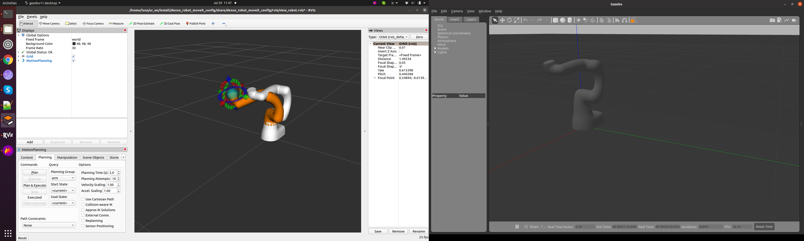

# SlaveMode Control for DENSO Robots

The SlaveMode control modality allows to control DENSO robots by sending the whole trajectory of the robotic arm.
The trajectory must be generated by an external motion planner (e.g. [MoveIt2](https://moveit.ros.org/)), and target points must be sent to the robot controller.

**NOTE**: The minimum required control frequency is 125 _Hz_ (1 target position each 8 _ms_).


## Usage

### 1.a Connect to a WINCAPS III-simulated Robot (Optional)

When connecting to a real robot, please be sure to complete the steps for [WINCAPS III preparation as described here](../README.md#simulated-environment-with-wincaps-iii).


### 1.b Connect to a Real Controller (Optional)

When connecting to a real robot, please be sure to complete the steps for [robot preparation as described here](../README.md#real-robot).


### 2. Start ROS2 Nodes

The main launch file that starts the application is in the `denso_robot_bringup` package.

  - COBOTTA robot:

   ```bash
   ros2 launch denso_robot_bringup denso_robot_bringup.launch.py model:=cobotta sim:=false ip_address:=192.168.0.1 send_format:=0 recv_format:=2
   ```

  - NOT COBOTTA robots (e.g. VS-060 robot):

   ```bash
   ros2 launch denso_robot_bringup denso_robot_bringup.launch.py model:=vs060 sim:=false ip_address:=192.168.0.1 send_format:=256 recv_format:=258
   ```


#### 2.1 Launch File Details

The main launch file that starts the application is in the `denso_robot_bringup` package:

   ```bash
   ros2 launch denso_robot_bringup denso_robot_bringup.launch.py model:=<robot_model> sim:=false ip_address:=<robot_ip_address> send_format:=<send_format_value> recv_format:=<recv_format_value>
   ```

The arguments for launch files can be listed using:

   ```bash
   ros2 launch denso_robot_bringup denso_robot_bringup.launch.py --show-args
   ```

The most relevant arguments are the following:

  - `model` (**mandatory**) - the model of the DENSO robot (COBOTTA, VS-060, etc.). In the original DENSO ROS2 stack 2 robot models are already available ( _"cobotta"_ , _"vs060"_).
    To use other robot types, see the _ROS2Converter_ page (**under construction**) for creating the URDF model and the associated [MoveIt2](https://moveit.ros.org/) configuration package
  - `ip_address` (**mandatory**) - IP address of the robot
  - `sim` (default: _true_) - whether the robot is simulated (Gazebo simulator) or an RC8 controller is connected (either WINCAPS III-simulated  or real controller)
  - `send_format` (default: _288_) - parameter to write Hand I/O, Mini I/O or User I/O signals (not considered if `sim:=true`). When Connecting to a COBOTTA robot assign value _"0"_ (no IO configuration)
  - `recv_format` (default: _292_) - parameter to read Hand I/O, Mini I/O or User I/O signals (not considered if `sim:=true`). When Connecting to a COBOTTA robot assign value _"2"_ (no IO configuration)
  - `bcap_slave_control_cycle_msec` (default: _8.0_) - DENSO robot control cycle \[ms\] (not considered if `sim:=true`)

| *DENSO ROS2 stack (simulation)* |
|:--:| 
|  | 


#### 2.2 Send Format Parameter

The _send\_format_ parameter can be used for write Hand I/O, Mini I/O or User I/O.
Following table shows the details of the _send\_format_ parameter.

| Value | I/O
| :---------: | :---: |
| 0 | None
| 32 | Hand I/O (Port 64 to 71)
| 256 | Mini I/O (Port 16 to 31)
| 288 | Hand I/O and Mini I/O
| 512 | User I/O (Port 128 or after)
| 544 | Hand I/O and User I/O


#### 2.3 Receive Format Parameter

The _recv\_format_ parameter can be used for write Hand I/O, Mini I/O or User I/O.
Following table shows the details of the _recv\_format_ parameter.

| Value | I/O
| :---------: | :---: |
| 0 | None
| 34 | Hand I/O (Port 48 to 55 and 64 to 71)
| 258 | Mini I/O (Port 0 to 31)
| 290 | Hand I/O and Mini I/O
| 514 | User I/O (Port 128 or after)
| 546 | Hand I/O and User I/O


### 3. Read and Write I/O Lines (Optional)

When setting the _send\_format_ and _recv\_format_ parameters, proper subscribers and publishers are launched.

#### Writing Mini I/O
When assigning values 256 or 288 to the _send\_format_ parameter, a subscriber named _"/${model}/Write\_MiniIO"_ is launched.
The subscriber's format is _std\_msgs/msg/UInt32_.
The least significant bit means I/O port 0 and the most significant bit means port 31.

#### Reading Mini I/O
When assigning values 258, 290 or 770 to the _recv\_format_ parameter, a publisher named _"/${model}/Read\_MiniIO"_ is launched.
The publisher's format is _std\_msgs/msg/UInt32_.
The least significant bit means I/O port 0 and the most significant bit means port 31.

#### Writing Hand I/O
When assigning values 32, 288 or 544 to the _send\_format_ parameter, a subscriber named _"/${model}/Write\_HandIO"_ is launched.
The subscriber's format is _std\_msgs/msg/UInt32_.
The least significant bit means I/O port 48 and the most significant bit means port 79.

#### Reading Hand I/O
When assigning values 34, 290 or 546 to the _recv\_format_ parameter, a publisher named _"/${model}/Read\_HandIO"_ is launched.
The publisher's format is _std\_msgs/msg/UInt32_.
The least significant bit means I/O port 48 and the most significant bit means port 79.

#### Writing User I/O
When assigning values 512 or 544 to the _send\_format_ parameter, a subscriber named _"/${model}/Write\_SendUserIO"_ is launched.
The subscriber's format is _denso\_robot\_core\_interfaces/UserIO_.
The offset parameter means the beginning of user I/O ports to write.
It has to be greater than 127, and be multiple of 8.
The size parameter means the length of the value array.
The value array means the I/O states to write.
The least significant bit of the first element means I/O port ${offset}+0, and the most significant bit means port ${offset}+7, and so on.

#### Reading User I/O
When assigning values 514, 546 or 770 to the _recv\_format_ parameter, a subscriber named _"/${model}/Write\_RecvUserIO"_ and a publisher named _"/${model}/Read\_RecvUserIO"_ are launched.
The subscriber's and publisher's format are _denso\_robot\_core\_interfaces/UserIO_.
The offset parameter means the beginning of user I/O ports to read. It has to be greater than 127, and be multiple of 8.
The size parameter means the number of I/O ports to read. It has to be the value dividing the number of I/O ports to read by 8.
For example, if you want to read 8 I/O ports, you should set 1 as this parameter.
The value array does not use in the _"/${model}/Write\_RecvUserIO"_.
In the _"/${model}/Read\_RecvUserIO"_, it means the I/O states to have had read.
The least significant bit of the first element means I/O port ${offset}+0, and the most significant bit means port ${offset}+7, and so on.


### 4. Run the MoveIt2 Demo for Pick-and-Place

#### Run the MoveIt2 Demo for Pick-and-Place (6 DOF Robot Arms)
To launch the [MoveIt2](https://moveit.ros.org/) demo node for pick-and-place application in case of 6DOF robot arms (e.g. COBOTTA, VS060, etc.) run the following command:

   ```bash
   ros2 launch denso_robot_moveit_demo denso_robot_moveit_pickandplace.launch.py model:=<robot_model> scale_factor:=<0.01 - 1.0> num_cycles:=<number_of_pick_and_place_cycles>
   ```

The arguments for launch files can be listed using:

   ```bash
   ros2 launch denso_robot_moveit_demo denso_robot_moveit_pickandplace.launch.py --show-args
   ```

The most relevant arguments are the following:

   - `model` (**mandatory**) - the model of the DENSO robot (COBOTTA, VS-060, etc.). In the original DENSO ROS2 stack 2 robot models are already available ( _"cobotta"_ , _"vs060"_).
     To use other robot types, see the _ROS2Converter_ page (**under construction**) for creating the URDF model and the associated [MoveIt2](https://moveit.ros.org/) configuration package
   - `scale_factor` (default: _0.1_) - motion speed \[0.01-1.0\]
   - `num_cycles` (default: _1_) - number of times to repeat the pick-and-place cycle

#### Run the MoveIt2 Demo for Pick-and-Place (4 DOF Robot Arms)
To launch the [MoveIt2](https://moveit.ros.org/) demo node for pick-and-place application in case of 4DOF robot arms (SCARA robot arms) run the following command:

  **Please note that for the moment SCARA robots can only be controlled sending target positions in joint space (no Inverse Kinematics plugin has been developed so far) !!**

   ```bash
   ros2 launch denso_robot_moveit_demo denso_robot_moveit_pickandplace_scara.launch.py model:=<robot_model> scale_factor:=<0.01 - 1.0> num_cycles:=<number_of_pick_and_place_cycles>
   ```

The arguments for launch files can be listed using:

   ```bash
   ros2 launch denso_robot_moveit_demo denso_robot_moveit_pickandplace_scara.launch.py --show-args
   ```

The most relevant arguments are the following:

   - `model` (**mandatory**) - the model of the DENSO SCARA robot. Description files for SCARA robots (URDF model and associated [MoveIt2](https://moveit.ros.org/) configuration package) must be created using the _ROS2Converter Tool_ (**under construction**)
   - `scale_factor` (default: _0.1_) - motion speed \[0.01-1.0\]
   - `num_cycles` (default: _1_) - number of times to repeat the pick-and-place cycle


#### Run the General Purpose MoveIt2 Demo
To launch the [MoveIt2](https://moveit.ros.org/) demo node run the following command:

   ```bash
   ros2 launch denso_robot_moveit_demo denso_robot_moveit_demo.launch.py model:=<robot_model> scale_factor:=<0.01 - 1.0>
   ```

The arguments for launch files can be listed using:

   ```bash
   ros2 launch denso_robot_moveit_demo denso_robot_moveit_demo.launch.py --show-args
   ```

The most relevant arguments are the following:

  - `model` (**mandatory**) - the model of the DENSO robot (COBOTTA, VS-060, etc.). In the original DENSO ROS2 stack 2 robot models are already available ( _"cobotta"_ , _"vs060"_).
    To use other robot types, see the _ROS2Converter_ page (**under construction**) for creating the URDF model and the associated [MoveIt2](https://moveit.ros.org/) configuration package
  - `scale_factor` (default: _0.1_) - motion speed \[0.01-1.0\]


### Example Commands for I/O Lines (Mini I/O Configuration)

Topics used for reading and writing I/O lines are (in case of `model:=cobotta`, `send_format:=256` and `recv_format:=258` - MiniIO configuration for COBOTTA robot model):

   ```bash
   /cobotta/Read_MiniIO
   /cobotta/Write_MiniIO
   ```

 - To read I/O lines:

   ```bash
   ros2 topic echo /cobotta/Read_MiniIO
   ```

   Output will be (I/O lines are converted to UInt value):

   ```bash
   data: 6881280
   ---
   data: 6881280
   ---
   ```

 - To write I/O lines (I/O lines are converted to UInt value):

   ```bash
   ros2 topic pub --once /cobotta/Write_MiniIO std_msgs/msg/UInt32 "data: 23658496"
   ```

